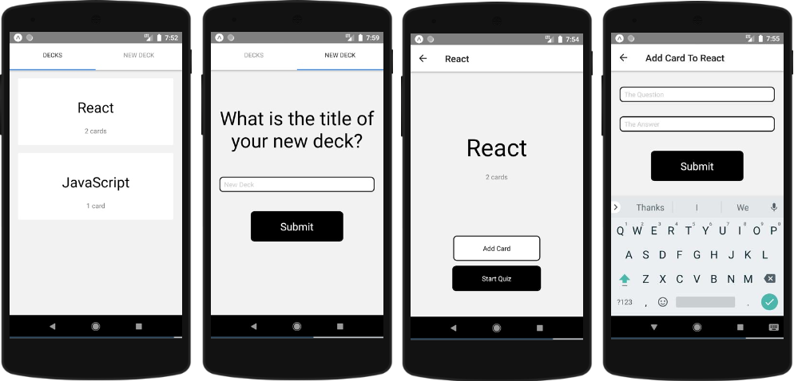

# Mobile Flashcards App

## About:

This app was built as a project for the [Udacity React Nanodegree Program](https://www.udacity.com/course/react-nanodegree--nd019).
It is a mobile application that allows users to study collections of flashcards. The app will allow users to create different categories of flashcards called "decks", add flashcards/questions to those decks, then take quizzes on those decks.

It was designed for Android, despite the fact that some components could also be used on IOS.

## Screenshots

Main Views

  

Quiz View

  

## Demo

You can checkout a live demo at [mobile-flashcards](https://expo.io/@adel-abdellatif/mobile-flashcards).
You can do one of the following.
- Use your device:
    - Scan the QR Code using the Expo Client app on your physical device - [Android](https://play.google.com/store/apps/details?id=host.exp.exponent&referrer=www) or [iOS](https://itunes.apple.com/app/apple-store/id982107779?ct=www&mt=8)
- Use a [simulation](https://expo.io/appetize-simulator?url=https://expo.io/@adel-abdellatif/mobile-flashcards) in the browser:
	- Once the simulator has launched, follow these instructions:

	1. Click "Tap to Play".
	2. Scroll down and click on "Open project using Expo".
	3. The app should be up and running. Feel free to explore it.

	- Sometimes the simulator will not launch due to busy servers. If this happens, you can hit refresh or come back and visit when the servers are less busy.

## Installation

Clone the repository, and use npm or yarn to install the dependencies.
- Clone/Download this repo.
- Run `npm install`or `yarn install` in the project directory to install dependencies.

## Start

The project can be run with `npm start` or `yarn start`

This will startup the Expo Developer Tools in the browser.
You can then do one of the following.
- Use your device:
    - Scan the QR Code using the Expo Client app on your physical device - [Android](https://play.google.com/store/apps/details?id=host.exp.exponent&referrer=www) or [iOS](https://itunes.apple.com/app/apple-store/id982107779?ct=www&mt=8)
- Use the [Expo XDE](https://expo.io/tools) to run the application on an Android or iPhone simulator.
---
### Built with:

This is a [React Native](https://facebook.github.io/react-native/) mobile app, it was bootstrapped with [Create React Native App](https://github.com/react-community/create-react-native-app), using [Expo](https://expo.io/) and it utilizes:
- [Redux](https://redux.js.org/) to manage application state
- [react-navigation V5](https://reactnavigation.org/)
- [react-navigation/stack](https://reactnavigation.org/docs/stack-navigator/)
- [react-navigation/material-top-tabs](https://reactnavigation.org/docs/material-top-tab-navigator/)
- [AsyncStorage](https://facebook.github.io/react-native/docs/asyncstorage#docsNav) for maintaining app changes
- [Expo Notifications](https://docs.expo.io/versions/latest/sdk/notifications) to set reminders to use the app daily

### Resources

- The logo image is from [favpng.com](https://favpng.com/)
